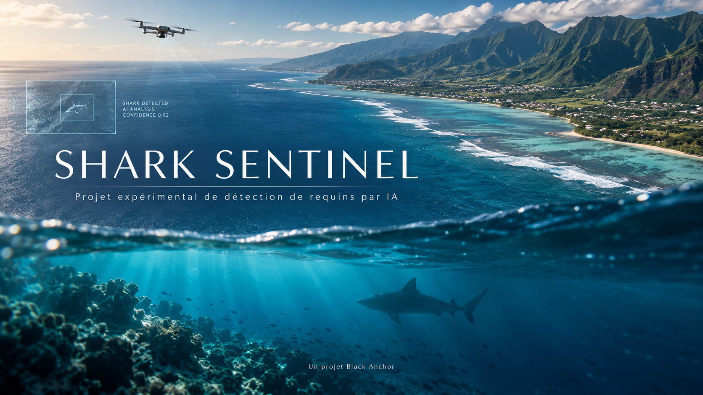

# Shark Sentinel



Détection expérimentale de requins et d'objets marins en vue aérienne, développée par Black Anchor (https://blackanchor.re).

Ce dépôt contient le code d'extraction, d'entraînement et de détection, un notebook Colab et les poids du modèle aérien YOLO11n. Le dataset, les annotations, les vidéos sources et les historiques d'entraînement ne sont pas distribués.

Outil expérimental : ne constitue pas un dispositif de sécurité validé et ne remplace pas la surveillance humaine.

## Installation

Depuis la racine du dépôt, avec Python 3.10 ou supérieur dans un environnement compatible avec PyTorch :

```powershell
python -m venv .venv
.venv\Scripts\Activate.ps1
python -m pip install -r requirements.txt
```

## Détection

Fournir sa propre vidéo ou image :

```powershell
python detect_shark_sentinel.py --source "chemin/video.mp4" --model models/shark-sentinel-aerial.pt --display --alert --alert-conf 0.6
```

`--source` accepte une image, un dossier d'images ou une vidéo. Les résultats sont enregistrés dans `runs/shark_sentinel/detections/`. Utiliser `--output` pour choisir un autre emplacement.

L'alerte repose par défaut sur 3 résultats positifs parmi 5 images analysées. Elle ne suit pas l'identité des objets : un faux positif persistant peut déclencher une alerte. `--frame-skip 2` réduit la fréquence d'analyse et répète la dernière image annotée entre les analyses. `--imgsz 480` réduit le calcul mais peut dégrader la détection des petits objets. Aucun réglage ne garantit la lecture en temps réel.

## Classes

| ID | Classe |
|---|---|
| 0 | shark |
| 1 | dolphin |
| 2 | whale |
| 3 | turtle |
| 4 | surfer |
| 5 | swimmer |
| 6 | rock |

Conserver cet ordre dans les annotations et dans LabelImg. Le YAML d'exemple se trouve dans `examples/dataset_example.yaml`.

## Entraîner avec ses propres données

Voir [le guide](guides/training.md). Deux domaines sont gérés par le code : `aerial` et `underwater`. Seul un modèle aérien spécialisé est fourni ici.

Le notebook `shark_sentinel_aerial_colab.ipynb` permet d'entraîner sur Colab avec sa propre archive de dataset. La disponibilité d'un GPU n'est pas garantie. Sauvegarder les poids avant la fin de session.

## Modèle et limites

Voir [MODEL_CARD.md](MODEL_CARD.md) pour la provenance, les limites et l'empreinte du modèle. Le dataset n'étant pas publié, l'entraînement original n'est pas intégralement reproductible à partir de ce dépôt.

## Licence

Code et poids distribués sous AGPL-3.0, voir [LICENSE](LICENSE). Ce projet utilise Ultralytics YOLO : https://www.ultralytics.com/license. Les données sources ne sont pas incluses et aucun droit sur celles-ci n'est accordé par ce dépôt.
